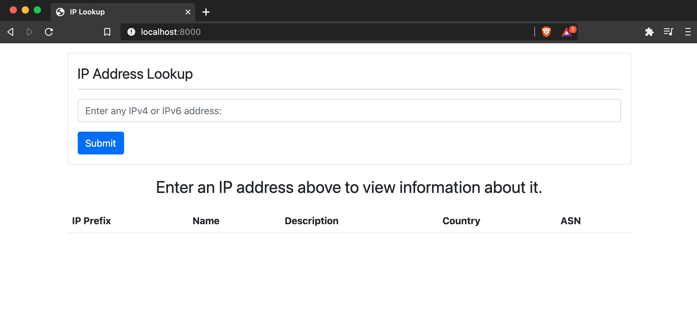
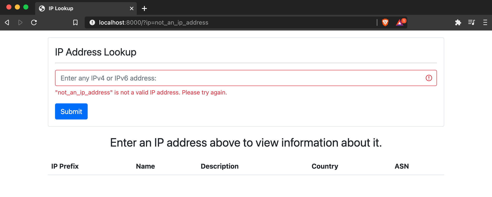
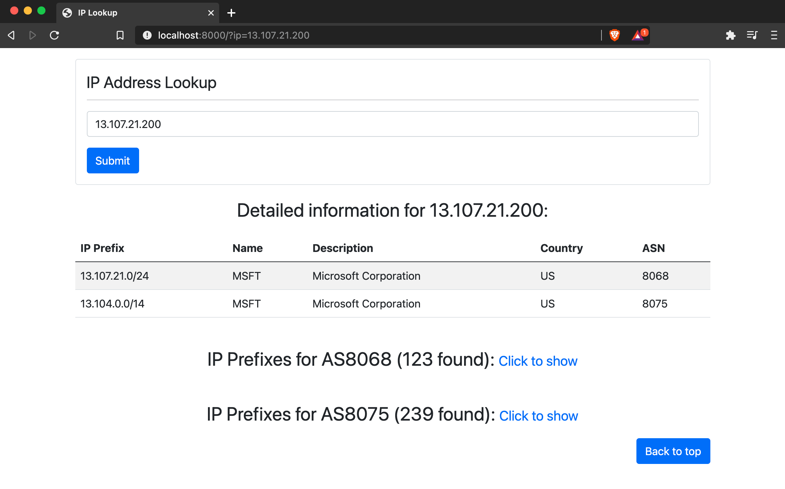
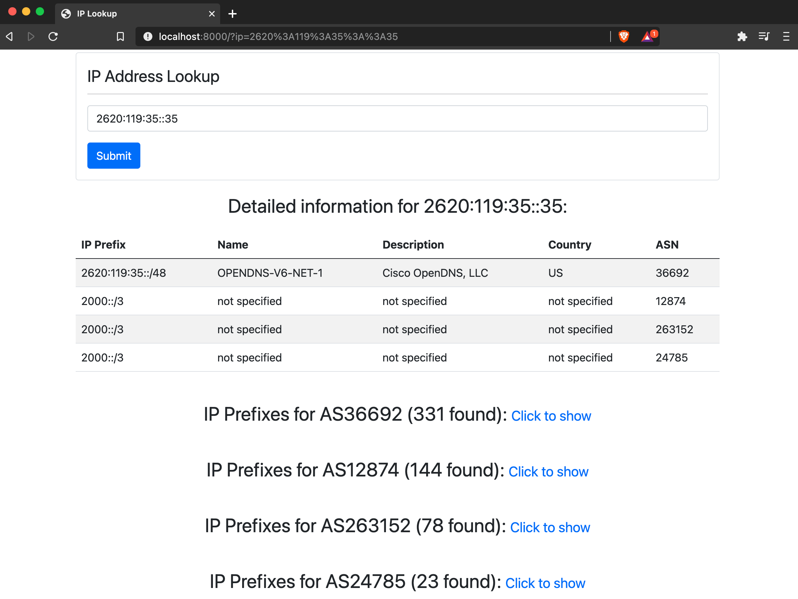
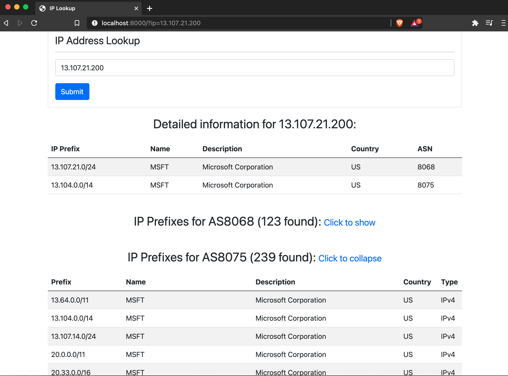
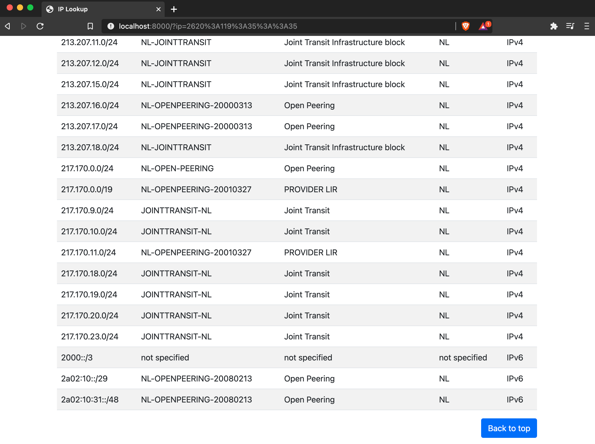

# ip-lookup
> FastAPI web app to view information about IP addresses

## Some Notes:
- Can skip installation by visiting deployed app at https://ip-addr-lookup.herokuapp.com/
  - Should be mobile-friendly!
  - May take a few seconds to load at first if Heroku app has gone idle
- Sometimes, both in local and deployed app, the API being used (see https://bgpview.docs.apiary.io/#reference/0/asn-prefixes) takes several seconds to respond, causing the page to load slowly. This is normal and should not happen every time.

## Installation:
NOTE: tested for Mac, but installation on Linux or Windows should be similar.   
Requirements: Python 3.6+, pip
- Clone repo with `git clone https://github.com/plt3/ip-lookup`
- Enter project directory with `cd ip-lookup`
- Recommended: create virtual environment: `python3 -m venv venv` and activate it: `source venv/bin/activate`
- Install dependencies with `pip install -r requirements.txt`

## Usage:
- In project home directory, run server with `uvicorn runApp:app`
- Navigate to http://localhost:8000 or http://127.0.0.1:8000 in browser
- When finished, kill the server with Ctrl + c

## Testing:
- Run small testing suite with `pytest` in project home directory (do not run server separately during testing)

## Screenshots:
### Main page once server is running:

### Form validation for search bar:

### ASN prefix tables are collapsed by default when searching:

### Can search for IPv6 address as well as IPv4:

### Click on "Click to show" to display ASN prefix tables:

### Tables can have lots of results:

